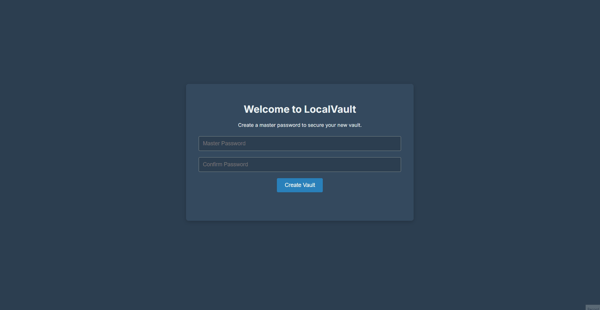

# LocalVault - A Secure Local Password Manager

## Project Genesis: Solving a Personal Problem

This project began as a direct solution to a personal need. I wanted a password manager that was simple, secure, and completely under my control. I was uncomfortable with my most sensitive data living on a third-party server, and I wanted the peace of mind that comes with local-only storage. Unable to find a tool that was both transparent in its security and simple in its execution, I decided to build my own.

**LocalVault is the result:** a cross-platform desktop application that provides a secure, private, and straightforward way to manage passwords. It operates on a **local-first** principle, meaning your sensitive data is **never** sent to or stored on any cloud server. Everything is encrypted and saved directly on your computer, giving you complete control.

## 🚀 Download the Latest Version

You can download the latest official installer for Windows, macOS, or Linux from the **[GitHub Releases Page](https://github.com/lucasgerbasi/LocalVault/releases/latest)**.

## ✨ Core Features (Version 3)

*   **State-of-the-Art Master Password Protection:** Your master password is protected by **Argon2id**, the current industry gold standard and winner of the Password Hashing Competition, providing superior resistance against modern brute-force attacks.
*   **End-to-End Encryption:** The entire vault is encrypted using **AES-2-GCM**, a modern authenticated encryption cipher that ensures both confidentiality and data integrity.
*   **Full Password Management (CRUD):**
    *   **Create:** Add new password entries, with an optional URL field.
    *   **Read:** Securely copy usernames/passwords to the clipboard and open associated URLs in the default browser.
    *   **Update:** Edit existing entries in a secure modal with a password reveal toggle.
    *   **Delete:** Permanently remove entries from the vault.
*   **Secure Utilities:** Includes a built-in **Password Generator** for creating strong credentials and a secure **Import/Export** system for encrypted vault backups.
*   **Robust Security Features:** The vault **Auto-Locks** after 5 minutes of inactivity, and the clipboard is automatically cleared after 30 seconds.
*   **Modern, Polished User Interface:** A completely redesigned UI with a professional font, **Light and Dark themes**, a real-time search filter, and custom-styled components for a seamless user experience.

## 🛡️ Security Philosophy

Security was the primary goal of this project. The architecture was designed to mitigate common threats:
1.  **No Cloud, No Server:** By avoiding a central server, we eliminate the risk of a remote data breach exposing user vaults.
2.  **Zero Knowledge:** The application code has no knowledge of your master password. If you forget it, your data is irrecoverable.
3.  **Tamper-Proof Vault:** The use of AES-2-GCM ensures that if the `vault.json` file is modified or corrupted in any way, decryption will fail, alerting the user to a potential issue.
4.  **Secure by Default:** Features like auto-lock and secure URL handling (`shell.openExternal`) are enabled by default to protect users.
5.  **Renderer Process Isolation:** Following Electron's security best practices, `contextBridge` is used to securely expose backend functions to the UI, preventing the renderer process from having access to Node.js APIs.

## 💻 Tech Stack

*   **Framework:** [Electron](https://www.electronjs.org/)
*   **Packaging:** [electron-builder](https://www.electron.build/)
*   **Backend Logic:** [Node.js](https://nodejs.org/) (using built-in `crypto`, `fs`, `shell` modules)
*   **Key Derivation:** [Argon2](https://www.npmjs.com/package/argon2) (via `argon2` npm package)
*   **Frontend:** HTML5, CSS3, and Vanilla JavaScript (no UI frameworks)
*   **Cryptography:**
    *   **Encryption Cipher:** AES-2-GCM
    *   **Key Derivation Function:** Argon2id